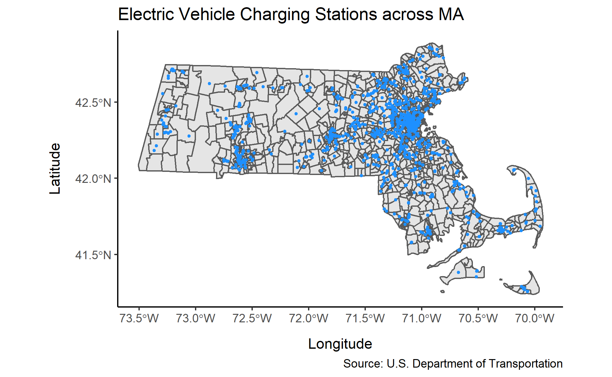

## Introduction
According to the United States Environmental Protection Agency, carbon dioxide from transportation accounts for about 27% of total U.S. greenhouse gas emissions, making it the largest contributor to climate change. In fact, a typical passenger vehicle emits about 4.6 metric tons of carbon dioxide per year. This is why it is so important to make the right decision when buying a new car. It could prevent millions of premature deaths due to air pollution and increased temperatures over the next century.

```{r setup, include=FALSE}
knitr::opts_chunk$set(echo = FALSE)
library(tidyverse)
library(rvest)
library(ggthemes)
library(janitor)
library(dplyr)
library(plotly)
library(tidycensus)
library(knitr)
```

## Graphs

```{r}
dataset <- read_csv(file="CO2Emissions.csv")
dataset <- clean_names(dataset)
```

```{r}
dataset |>
  select(make, model, co2_emissions_g_km) |>
  group_by(make) |>
  mutate(num_models = n(), sum_emissions = sum(co2_emissions_g_km)) |>
  summarize (make, average_emissions = sum_emissions / num_models) |>
  ungroup() |>
  unique() |>
  ggplot(mapping = aes(x = make, y = average_emissions)) +
  geom_col(fill="dodgerblue") +
  theme_minimal() +
  theme(axis.text.x = element_text(size = 8)) +
  theme(axis.text.x=element_text(angle = 90, vjust = 0.2)) +
  theme(axis.title.x = element_text(margin = margin(t = 5, r = 0, b = 0, l = 0))) +
  theme(axis.title.y = element_text(margin = margin(t = 0, r = 10, b = 0, l = 0))) +
  labs(title = "Average Tailpipe Emissions of CO2 by Car Brand",
       subtitle= "Of the gas powered cars sold in the US, Honda's have the lowest average CO2 emissions",
       x = "Brand",
       y = "Average CO2 Emissions (G/km)",
       caption = "Source: CO2 Emission by Vehicles") +
  theme(plot.subtitle = element_text(size = 10)) +
  theme(plot.title = element_text(face = "bold")) +
  coord_cartesian(ylim = c(100, 550))
```

[@Emission]


### Analysis

The graph above shows the average tailpipe emission of carbon dioxide that cars from different companies produce during combined city and highway driving. It makes it clear that out of all the gas powered cars sold in the United States, Honda's are the most eco-friendly, while Bugatti's are the least efficient and produce the most CO2. This information is very important when buying a gas powered car, however, some people know that they want to go full electric.


*The graph below is interactive! Click Around!*

```{r}
dataset2 <- read.csv(file="ElectricCarData_Clean.csv")
```

```{r}
EVdata <- dataset2 |>
          select(Brand, Model, Range_Km, Efficiency_WhKm) |>
          arrange(Brand) |>
          ggplot(mapping = aes(x = Range_Km, y = Efficiency_WhKm, color = Brand, label = Model)) +
          geom_point() +
          theme_minimal() +
          labs(title="Range and Efficiency of Different Electric Vehicles",
               x = "Range (Km)",
               y = "Effciency (Wh/KM - Lower is better)")
ggplotly(EVdata)
```

[@EV]


### Analysis

The graph above is for individuals who want to buy a fully electric car, but aren't sure if the range they offer is sufficient and are concerned about how much energy they consume. It shows the mileage of different EV's on a full tank and also the number of watts they consume per kilometer. From looking at the graph, one can quickly deduct that the new Tesla Roadster (not in production yet due to supply chain shortages) has the furthest range, while the Lightyear One is the most efficient. 


```{r, echo = FALSE}

```

[@EVstation]


### Analysis

The map above contains points that mark the location of different electric vehicle charging stations across the state of Massachusetts. It makes it clear that there are many charging stations avalable for an individual who is looking to buy an electric car, and proves that buying and daily driving one won't be a struggle. Along with the fact that they provide for a cleaner environment and are easy to charge up, electric vehicles come with many other benefits too. They deliver a better driving experience, they reduce noise pollution, that have increased resale value, and they have lower maintenance costs. 
